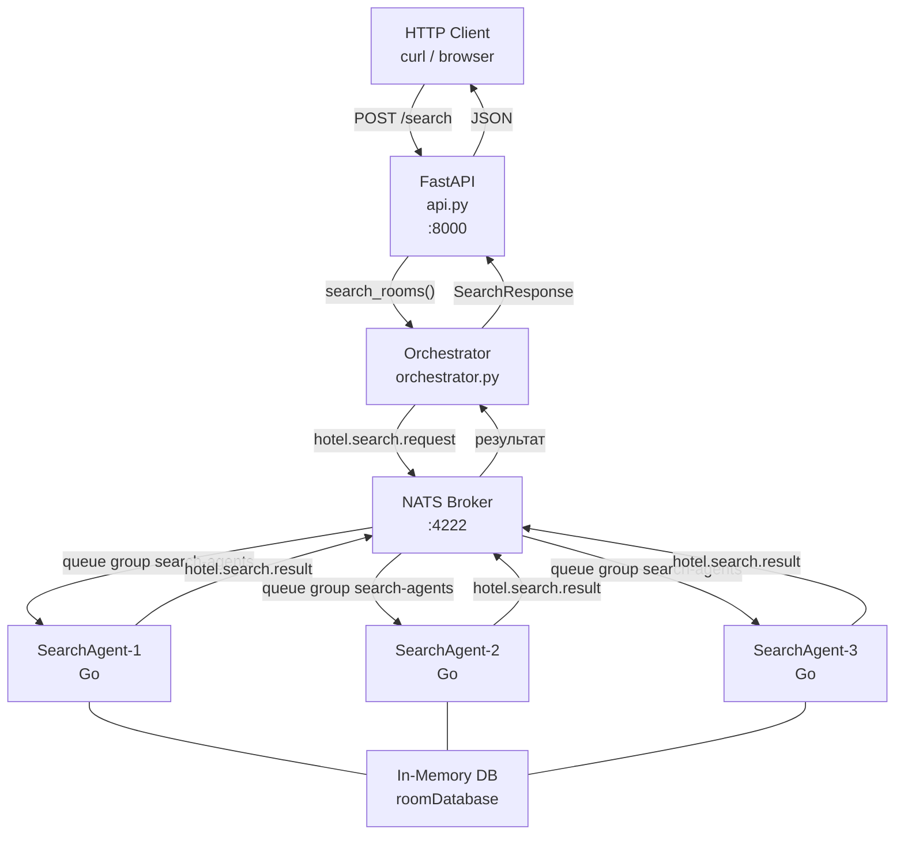
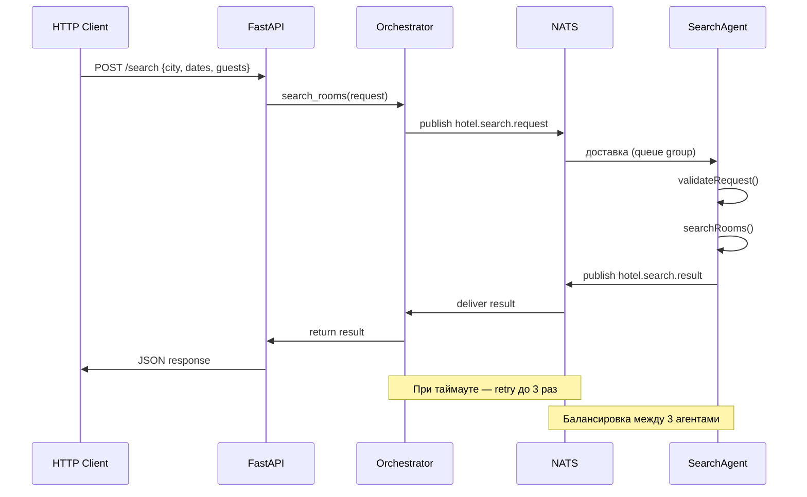

# Архитектура системы бронирования гостиниц

## Диаграмма взаимодействия компонентов



## Диаграмма последовательности



## Описание компонентов

### 1. FastAPI (api.py)

- **Роль**: точка входа, REST API
- **Порт**: 8000
- **Эндпоинты**: GET /health, POST /search
- **Технологии**: Python, FastAPI, uvicorn

### 2. Orchestrator (orchestrator.py)

- **Роль**: управляет задачами, отправляет в NATS, ждёт результаты
- **Функции**: retry до 3 раз, таймаут, метрики
- **Технологии**: Python, asyncio, nats-py

### 3. NATS Broker

- **Роль**: брокер сообщений, маршрутизация между компонентами
- **Порты**: 4222 (клиенты), 8222 (мониторинг)
- **Топики**:
  - hotel.search.request — запросы от оркестратора
  - hotel.search.result — успешные результаты
  - hotel.search.error — ошибки валидации
- **Queue group**: search-agents — балансировка между агентами

### 4. SearchAgent (Go)

- **Роль**: обрабатывает поисковые запросы
- **Количество**: 3 экземпляра
- **Функции**: валидация, поиск по базе, проверка доступности по датам
- **Бизнес-правила**:
  - check_out > check_in
  - capacity >= guests
  - максимум 365 дней вперёд
  - алгоритм пересечения интервалов для броней

### 5. In-Memory Database

- **Роль**: хранит номера и существующие брони
- **Данные**: 6 номеров в 3 гостиницах (Москва, Сочи)

## Структура проекта

```
hotel-mas/
├── search-agent/
│   ├── main.go           # SearchAgent (Go)
│   ├── main_test.go      # юнит-тесты Go
│   ├── Dockerfile
│   ├── go.mod
│   └── go.sum
├── orchestrator.py       # оркестратор
├── api.py                # REST API
├── test_orchestrator.py  # тесты оркестратора
├── test_api.py           # тесты API
├── test.py               # ручное тестирование
├── docker-compose.yml    # NATS + 3 агента
├── pytest.ini
├── requirements.txt
└── .gitignore
```

## Паттерны взаимодействия

| Паттерн | Где используется |
|---------|-----------------|
| Pipeline | Client → API → Orchestrator → Agent |
| Queue Group | балансировка между 3 агентами |
| Request-Reply | оркестратор ждёт ответ через Future |
| Retry | повтор до 3 раз при таймауте |
